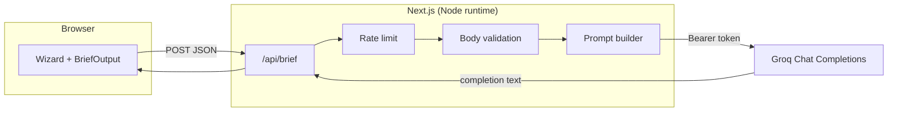

<div align="center">

# DevBrief

**Turn a product idea into a structured dev brief—in one fluent flow, backed by server-side inference.**

[](https://nextjs.org/)
[](https://www.typescriptlang.org/)
[](https://tailwindcss.com/)
[](https://groq.com/)

[Features](#-features) · [Quick start](#-quick-start) · [API](#-api) · [Configuration](#️-configuration) · [Project layout](#-project-layout)


*Pitch wizard → Groq (Llama) inference → editable brief preview, copy & download.*

</div>

---

**DevBrief** is an open **[Next.js 14 App Router](https://nextjs.org/)** MVP that converts a **product idea**, **startup pitch**, or **software concept** into a **technical project brief** (summary, **tech stack**, **milestones**, **timeline**, **budget** hints). Inference runs server-side via **[Groq](https://groq.com/)** (**OpenAI-compatible** chat completions); the browser never receives your **`GROQ_API_KEY`**. Structured prompts support **multiple output languages** (**EN / DE / FR / IT**). Public API routes: **`GET /api/brief`** (health) and **`POST /api/brief`** (**rate-limited**) calling **`https://api.groq.com/openai/v1/chat/completions`**.

---

## Features

| | |
| :--- | :--- |
| **Groq-hosted LLMs** | Default model `llama-3.3-70b-versatile`; override via `GROQ_MODEL`. |
| **Structured prompts** | Server-built messages (`lib/brief-ai-prompt.ts`, `section-headings.ts`) keyed by locale (`en`, `de`, `fr`, `it`) and sections. |
| **UX** | Neo-brutalist shell, conduit backdrop, theme toggle (**light / dark**), swipe-friendly wizard, recap before submit. |
| **Outputs** | After generation: **Preview** in a layered dialog, **plain-text download**, clipboard **copy**. |
| **Operational guardrails** | In-memory **rate limit** (per identity, rolling window)—see [`lib/brief-rate-limit.ts`](lib/brief-rate-limit.ts). |
| **Health check** | `GET /api/brief` exposes `groqConfigured` and model **without** leaking the API key. |

---

## Architecture



---

## Quick start

**Requirements:** Node.js **18+** and npm (or compatible package manager).

```bash
npm install

# Secrets (never commit): copy env example → .env.local
cp .env.example .env.local
# Edit .env.local → set GROQ_API_KEY (https://console.groq.com/keys)

npm run dev
```

Open **http://localhost:3000**, complete the wizard, then **generate** once your pitch is valid.

Production build smoke test:

```bash
npm run build
npm run start
```

---

## API

Base path: **`/api/brief`** (relative to the deployed origin).

### `GET /api/brief`

Sanity probe for tooling and dashboards. Safe to expose publicly.

```json
{
  "ok": true,
  "groqConfigured": true,
  "model": "llama-3.3-70b-versatile",
  "hint": null
}
```

If no key is set, `groqConfigured` is `false` and `hint` explains how to fix it.

---

### `POST /api/brief`

Generates a brief. Body must be **JSON**.

**Example:**

```json
{
  "idea": "Cross-platform journaling app with end-to-end encryption and voice notes.",
  "sections": {
    "summary": true,
    "techStack": true,
    "milestones": true,
    "timeline": true,
    "budget": false
  },
  "detail": "medium",
  "locale": "en"
}
```

| Field | Type | Rules |
| ----- | ---- | ------ |
| `idea` | `string` | Trimmed length **10–3000**. |
| `sections` | `Record<BriefSectionId, boolean>` | Every key required; **`summary`, `techStack`, `milestones`, `timeline`, `budget`**; at least one `true`. |
| `detail` | `"short" \| "medium" \| "long"` | Maps to **`max_tokens`** caps on the server. |
| `locale` | `"en" \| "de" \| "fr" \| "it"` | Drives headings and wording in the composed prompt. |

**Success (`200`):**

```json
{ "ok": true, "text": "…Markdown-friendly plain brief…" }
```

**Common errors:**

| HTTP | Meaning |
|------|---------|
| `400` | Malformed JSON, invalid fields, empty sections. |
| `429` | Rate limit exceeded. Response includes **`Retry-After`** (seconds). Body: `error: "ratelimit"`. |
| `502` – `504` | Upstream Groq failure, empty model output, timeout, etc. Inspect `message` / `error` in JSON. |
| `503` | **`GROQ_API_KEY`** missing on the server (`error: "missing_key"`). |

---

## ⚙️ Configuration

| Variable | Required | Description |
| -------- | ---------- | ----------- |
| `GROQ_API_KEY` | **Yes** for generation | Bearer token from [Groq Console](https://console.groq.com/keys). |
| `GROQ_MODEL` | No | Defaults to **`llama-3.3-70b-versatile`** if unset. |

See **[`.env.example`](.env.example)** for comments and parity with local setup.

> **Security:** Keep keys in `.env.local` or host secrets manager only. The client bundle must never embed `GROQ_API_KEY`.

---

## Rate limiting (MVP note)

Quota is enforced **per process**, using request identity derived from **`x-forwarded-for`** (first hop), **`x-real-ip`**, **`cf-connecting-ip`**, or `unknown`.
For **multiple server instances** or edge regions, migrate to Redis / Upstash (or platform-native rate limiting) so counts stay coherent.

---

## Scripts

| Command | Purpose |
| ------- | ------- |
| `npm run dev` | Next.js dev server (Turbopack not enabled by default in this repo). |
| `npm run build` | Optimized production build + type-check. |
| `npm run start` | Serve the production bundle. |
| `npm run lint` | ESLint (`eslint-config-next`). |

---

## Project layout

```text
./
├── README.md                   ← Repo overview (same file GitHub renders)
├── app/
│   ├── api/brief/route.ts      # POST + GET handlers, Groq client
│   ├── globals.css
│   ├── layout.tsx
│   └── page.tsx
├── components/
├── lib/
├── .env.example
└── package.json
```

---

## Deploying

Optimized for **[Vercel](https://vercel.com)** (same team as Next.js): set **`GROQ_API_KEY`** in Project → Environment Variables; optional **`GROQ_MODEL`**.

Review **`maxDuration`** in [`app/api/brief/route.ts`](app/api/brief/route.ts) against your hosting plan if generations run near the ceiling.

---

## License

Specify your license here (for example MIT, Apache-2.0, or proprietary). Until a **`LICENSE`** file exists, assume **all rights reserved** by the repository owner.

---

<div align="center">

**Built for clarity—from idea to actionable brief.**

</div>
