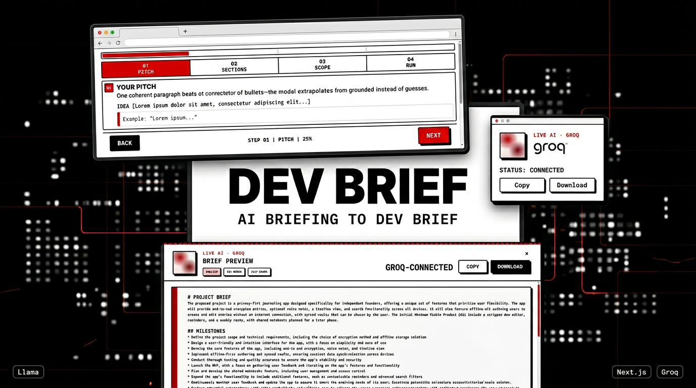

<div align="center">

# DevBrief

**Product pitch → AI-generated project brief.** Neo-brutalist UI, **Groq** on the server—the client never sees your API key.

### [devbrief-ai.vercel.app](https://devbrief-ai.vercel.app/)

[](https://devbrief-ai.vercel.app/)
[](https://nextjs.org/)
[](https://groq.com/)



</div>

---

**What it does:** Stepped wizard → choose sections (summary, tech stack, milestones, timeline, budget), depth, language **(en · de · fr · it)** → **Preview**, **copy**, or **download** plain text.

**API:** [`GET /api/brief`](https://devbrief-ai.vercel.app/api/brief) (config probe) · `POST /api/brief` (JSON body, rate-limited) — details in `app/api/brief/route.ts`.

## Run locally

```bash
npm install
cp .env.example .env.local
```

Set **`GROQ_API_KEY`** in `.env.local` ([Groq keys](https://console.groq.com/keys)). Optional: **`GROQ_MODEL`** (defaults in code).

```bash
npm run dev
```

Open [localhost:3000](http://localhost:3000).

## Deploy ([Vercel](https://vercel.com))

Add **`GROQ_API_KEY`** in Project → Environment Variables (Production + Preview). Redeploy after changes.
