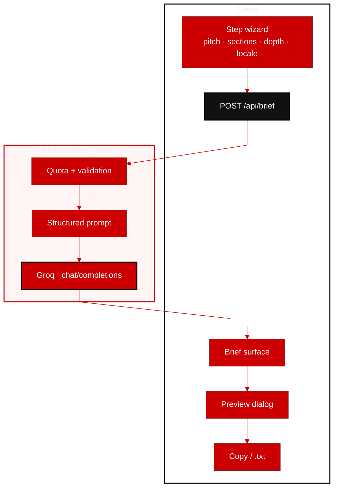

<p align="center">
  <a href="https://devbrief-ai.vercel.app/"><strong>DEVBRIEF</strong></a>
</p>
<p align="center">
  Turn a concise pitch into a developer-ready brief—<strong>Neo-brutalist UI</strong>, <strong>Groq (Llama)</strong> inference on the server.<br/>
  Your <code>GROQ_API_KEY</code> never touches the bundle.
</p>

<p align="center">
  <a href="https://devbrief-ai.vercel.app/"></a>
  <a href="https://groq.com/"></a>
</p>

<p align="center">
  <a href="https://nextjs.org/"></a>
  <a href="https://www.typescriptlang.org/"></a>
  <a href="https://tailwindcss.com/"></a>
</p>

<p align="center">
  <strong>Creator</strong> · 
  <a href="https://x.com/WebRaizo"></a>
</p>

<p align="center">
  <a href="https://devbrief-ai.vercel.app/">devbrief-ai.vercel.app</a>
</p>

<br/>

<p align="center">
  <kbd>FLOW</kbd> · wizard → validate → infer → preview · copy · download
</p>



<br/>

## Snapshot

| | |
| ---: | :--- |
| **Demo** | [devbrief-ai.vercel.app](https://devbrief-ai.vercel.app/) |
| **Health** | [`GET /api/brief`](https://devbrief-ai.vercel.app/api/brief) |
| **Languages** | EN · DE · FR · IT output |
| **Sections** | Summary, tech stack, milestones, timeline, budget |

<p align="center">
  
</p>

---

## Run locally

```bash
npm install
cp .env.example .env.local
# GROQ_API_KEY=…  →  https://console.groq.com/keys
npm run dev
```

→ [http://localhost:3000](http://localhost:3000)

## Deploy on Vercel

Project → **Environment Variables** → `GROQ_API_KEY` (and optional `GROQ_MODEL`) for **Production** & **Preview**, then redeploy.

---

<p align="center">
  <sub>Built by <a href="https://x.com/WebRaizo"><strong>@WebRaizo</strong></a> · MIT-ready (add a <code>LICENSE</code> when you pick one)</sub>
</p>
